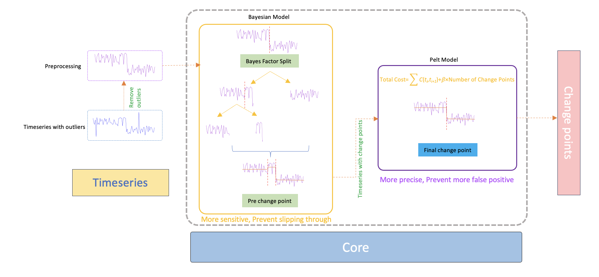

# BIPeC: A Combined Change-Point Analyzer to Identify Performance Regressions in Large-scale Database Systems

Source code and materials for the paper

----

Zhan Lyu, Thomas Bach, Yong Li, Nguyen Minh Le and Lars Hoemke.
2024
_BIPeC: A Combined Change-Point Analyzer to Identify Performance Regressions in Large-scale Database Systems_.
rest_to_be_created

----

Link to publisher (to be created)

Copy to cite (bibtex from ACM):

``` bibtex
@inproceedings{
    title=to_be_created
}
```

Details will be added after the conference publication process has happened.

We will also add a citation file for github.

## Welcome to BIPeC

Our approach Bayesian Initiated PELT Confirmation (BIPeC) integrates Bayesian inference with the Pruned Exact Linear Time (PELT) algorithm. 
The allows to enhance the detection of change points and performance regressions with high precision and efficiency compared to previous approaches.

The architecture of BIPeC:



## Usage

There are several prerequisites that need to be installed in advance.

You should have python >= 3.10.

### Install packages

Install the required packages.
You may prefer to do this in a virtual environment.

``` bash
pip install -r requirements.txt
```

### Run BIPeC

Add your csv file to the path.

``` bash
python bipec.py --data {your csv dataset} --column_name {csv column name}
```

Then you will get the change points list.
Support parameters:

* **pen**: Penalty value for the Pelt model.
* **window_size**: Number of data points in each sliding window for analysis.
* **chunk_size**: Number of data points in each chunk for processing time series data.
* **log_odds_threshold**: Log odds threshold for Bayesian detection.
* **plot**: Enable plotting of the results.


## Support, Feedback, Contributing

This project is open to feature requests/suggestions, bug reports etc. via [GitHub issues](https://github.com/SAP/BIPeC-a-Combined-Change-Point-Analyzer/issues). Contribution and feedback are encouraged and always welcome. For more information about how to contribute, the project structure, as well as additional contribution information, see our [Contribution Guidelines](CONTRIBUTING.md).

## Security / Disclosure

If you find any bug that may be a security problem, please follow our instructions at [in our security policy](https://github.com/SAP/BIPeC-a-Combined-Change-Point-Analyzer/security/policy) on how to report it. Please do not create GitHub issues for security-related doubts or problems.

## Code of Conduct

We as members, contributors, and leaders pledge to make participation in our community a harassment-free experience for everyone. By participating in this project, you agree to abide by its [Code of Conduct](https://github.com/SAP/.github/blob/main/CODE_OF_CONDUCT.md) at all times.

## Licensing

Copyright SAP SE or an SAP affiliate company and contributors to this project. Please see our [LICENSE](LICENSE) for copyright and license information. Detailed information including third-party components and their licensing/copyright information is available [via the REUSE tool](https://api.reuse.software/info/github.com/SAP/BIPeC-a-Combined-Change-Point-Analyzer).
